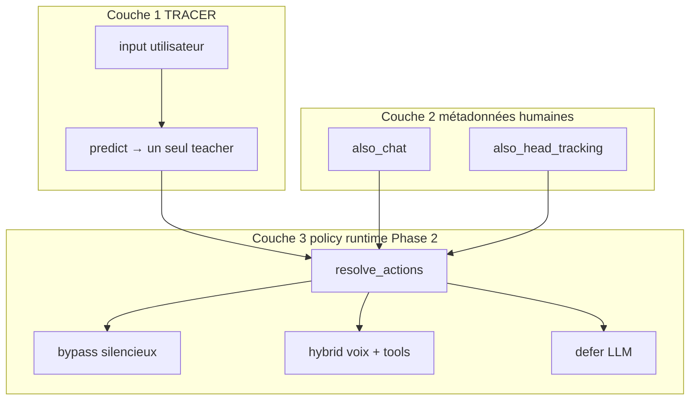

# Gate policy — Phase 2 (roadmap et spécifications)

> Document de suivi pour l'évolution du intent gate au-delà du bypass/defer actuel.
> Phase 1 (livré) : annotation `also_*` + `derive_gate_policy.py` — **aucun changement runtime**.
> Lire aussi : [SPEC_ANNOTATION_TOOL.md](SPEC_ANNOTATION_TOOL.md), [SPEC_TRACER_REACHY.md](../../../SPEC_TRACER_REACHY.md) §9.5.

---

## Table fait / pas fait

| Élément | Phase 1 | Phase 2 |
|---------|---------|---------|
| `also_head_tracking` dans annotate + JSONL | **Oui** | — |
| `also_chat` dans annotate (UI améliorée) | **Oui** | Runtime hybrid |
| `derive_gate_policy.py` (rapport + snippet) | **Oui** | Intégration auto optionnelle |
| Preview Phase 2 dans annotate (`/api/preview`) | **Oui** | — |
| Enrichment multi-tools runtime | Non | Oui (`resolve_actions`) |
| Mode hybrid (voix + tools locaux) | Non | Oui (`GateDecision` + `_execute_hybrid`) |
| Format instructions LLM v2 (non dialogique) | Doc | Code |
| Injection contexte `<<gate_state>>` groupée | Non | Oui |
| Trace bypass multi-actions complète | Non | Oui (`actions[]`) |
| Re-fit TRACER | Non | Après micro + annotation |
| Profil Reachy `instructions.txt` | Hors scope | Profil séparé |
| Règles hardcodées surprise→regard | **Non** | Jamais — dérivation humaine |

---

## Modèle en 3 couches



- **TRACER** (`tracer.fit`) consomme uniquement `input` + `teacher`.
- Les flags `also_*` ne participent **pas** au fit ; ils alimentent la policy via récurrence annotée.

---

## Pipeline annotateur → runtime

1. Collecte live (`TRACE_COLLECT=1`) → `traces.jsonl`
2. Annotation (`python3 scripts/annotate.py`) → flags `also_chat`, `also_head_tracking`
3. Dérivation offline (`python3 scripts/derive_gate_policy.py`) → candidats enrichment / hybrid
4. **Revue humaine** du snippet Python généré
5. Phase 2 : intégration dans `intent_gate.py` + `base_realtime.py`
6. Re-fit TRACER sur dataset annoté
7. Validation robot (checklist §9.5 SPEC_TRACER_REACHY)

Seuils par défaut de dérivation : **≥ 3** traces par label, **≥ 60 %** avec le flag.

---

## Scénarios de référence

### D1 — Surprise + regard (bypass enrichi)

- **Input** : « Boo ! Je t'ai fait peur ? »
- **Annotation** : `teacher=play_emotion:surprised`, `also_head_tracking=true`, `also_chat=false`
- **Phase 2 runtime** : bypass silencieux `[head_tracking:on, play_emotion:surprised]` (ordre obligatoire)

```json
{"input": "Boo ! Je t'ai fait peur ?", "teacher": "play_emotion:surprised", "also_head_tracking": true}
```

### D2 — Marron + voix (hybrid)

- **Input** : « J'ai marron. »
- **Annotation** : `teacher=play_emotion:irritated`, `also_chat=true`, `also_head_tracking=false`
- **Phase 2 runtime** : émotion locale + `response.create(instructions=...)`

```json
{"input": "J'ai marron.", "teacher": "play_emotion:irritated", "also_chat": true, "source_teacher": "chat"}
```

### D3 — Chat pur (defer)

- **Input** : « Raconte-moi une blague. »
- **Annotation** : `teacher=chat`
- **Runtime** : defer → LLM + TTS, system prompt Reachy seul

### D4 — Commande pure (bypass existant)

- **Input** : « Regarde-moi. »
- **Annotation** : `teacher=head_tracking:on`
- **Runtime** : bypass silencieux (comportement actuel, inchangé)

---

## Multi-tools : sécurité workflow

Le bypass actuel enchaîne déjà N tools (`stop` = 2 tools). `head_tracking` + `play_emotion` **ne plante pas** :

| Tool | Système |
|------|---------|
| `head_tracking:on` | `camera_worker.set_head_tracking_enabled()` |
| `play_emotion` | `movement_manager.queue_move()` |

**Règles Phase 2 :**

1. Ordre obligatoire : `head_tracking:on` **puis** `play_emotion`
2. Erreur tool → defer LLM (fallback existant)
3. Risque visuel acceptable (tracking + move), pas de crash
4. Hybrid : tools locaux d'abord, puis voix ; **interdire** double exécution par le LLM
5. Limite audit actuelle : `on_gate_bypass` ne logue que le **premier** tool malgré `n_tools` — backlog Phase 2

---

## Format instructions LLM (non dialogique)

### Problème actuel

Chaque tool bypass injecte un faux message `role: user` (`[action exécutée sans réponse vocale : ...]`). Multi-tools = N fausses lignes user que le LLM peut traiter comme du dialogue.

### Hybrid — `response.create(instructions=...)` uniquement

Ne pas dupliquer le system prompt Reachy. Template Phase 2 :

```
Instructions de tour (ne pas lire à voix haute) :
- Contexte gate : l'émotion {intent} est déjà en cours côté robot.
- Tâche : répondre en français, 1 phrase courte (~12 mots), ton habituel.
- Interdit : appeler un tool ; mentionner gate, TRACER, ou mécanisme interne.
- L'utilisateur a dit : « {transcript} »
```

### Contexte post-bypass — injection groupée Phase 2

Remplacer N messages user par un bloc machine :

```
<<gate_state>>
actions=head_tracking:on;play_emotion:surprised
spoken=false
<</gate_state>>
```

**Règle** : seuls les vrais transcripts micro ont `role: user` sans marqueur `<<gate_*>>`.

### Séparation des couches

| Couche | Canal | Contenu |
|--------|-------|---------|
| Personnalité | Session `instructions` (profil Reachy) | Oral, court, curieux — jamais explicité |
| Consigne hybrid | `response.create(instructions=)` | Opérationnel, éphémère |
| État gate | `conversation.item.create` (format v2) | Factuel, non dialogique |

TRACER/gate **ne modifie pas** le system prompt session.

---

## Backlog Phase 2 (numéroté)

1. `resolve_actions(label, flags)` + enrichment depuis `derive_gate_policy.py`
2. `GateDecision = Literal["bypass", "hybrid", "defer"]` + `_execute_hybrid`
3. Refactor injection `<<gate_state>>` (remplace N messages user)
4. Anti double-exécution tools en hybrid
5. Trace collector multi-actions (`actions[]` ou log complet)
6. Tests robot + checklist §9.5 SPEC_TRACER_REACHY

---

## Commandes Phase 1

```bash
# Annotation
python3 scripts/annotate.py

# Dérivation policy (offline, revue humaine requise)
python3 scripts/derive_gate_policy.py
python3 scripts/derive_gate_policy.py --output tracer_data/.gate_policy_report.json
```
