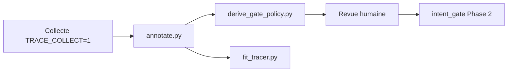

# Documentation et archives traces TRACER

## Workflow complet



1. **Collecte** : sessions robot avec `TRACE_COLLECT=1` → `../traces.jsonl`
2. **Annotation** : `python3 scripts/annotate.py` — valider/corriger, flags `also_chat` / `also_head_tracking`, preview Phase 2
3. **Dérivation policy** (offline) : `python3 scripts/derive_gate_policy.py` → rapport JSON + snippet Python à valider
4. **Re-fit** (après curation) : `python3 scripts/fit_tracer.py fit`
5. **Phase 2** (futur) : intégration manuelle des règles dans `intent_gate.py`

## Commandes

### Annotation

```bash
python3 scripts/annotate.py
# Ouvre http://127.0.0.1:8000 — finaliser crée traces.jsonl.bak-<timestamp>
```

### Dérivation gate policy (Phase 1, offline)

```bash
python3 scripts/derive_gate_policy.py
python3 scripts/derive_gate_policy.py --output tracer_data/.gate_policy_report.json
python3 scripts/derive_gate_policy.py --min-samples 3 --min-ratio 0.6
```

Ne modifie **jamais** `intent_gate.py` automatiquement.

### Curation et bootstrap

```bash
python3 scripts/curate_traces.py
python3 scripts/bootstrap_traces.py generate
python3 scripts/bootstrap_traces.py merge
python3 scripts/bootstrap_traces.py stats tracer_data/traces_all.jsonl
```

### Fit TRACER

```bash
python3 scripts/fit_tracer.py fit
python3 scripts/fit_tracer.py fit --reuse-embeddings
python3 scripts/fit_tracer.py report
python3 scripts/fit_tracer.py report-html --no-open
```

Le rapport `../.tracer/report.html` est en **français** avec contexte Reachy Mini.

## Documentation

| Fichier | Contenu |
|---------|---------|
| [SPEC_ANNOTATION_TOOL.md](SPEC_ANNOTATION_TOOL.md) | Outil d'annotation, flags `also_*`, palette |
| [GATE_POLICY_PHASE2.md](GATE_POLICY_PHASE2.md) | Roadmap Phase 2, scénarios D1–D4, multi-tools, format LLM |
| [../EMOTIONS_REFERENCE.md](../EMOTIONS_REFERENCE.md) | Référence émotions |
| [../../../SPEC_TRACER_REACHY.md](../../../SPEC_TRACER_REACHY.md) | Spec projet, §9.5 gate Phase 2 |

## Archives

- `traces_raw_annotated_2026-06-18.jsonl` : export brut avec commentaires `# teacher : ...`
- `traces_curated_v1_2026-06-18.jsonl` : première version curée
- `../traces.jsonl` : fichier actif (annoté via `annotate.py`)
- `../traces_synthetic.jsonl` : paraphrases FR bootstrap
- `../traces_all.jsonl` : réel + synthétique fusionné (entrée du fit)

Artifacts : `../.tracer/` (manifest, pipeline, qualitative_report, embedder.txt).
